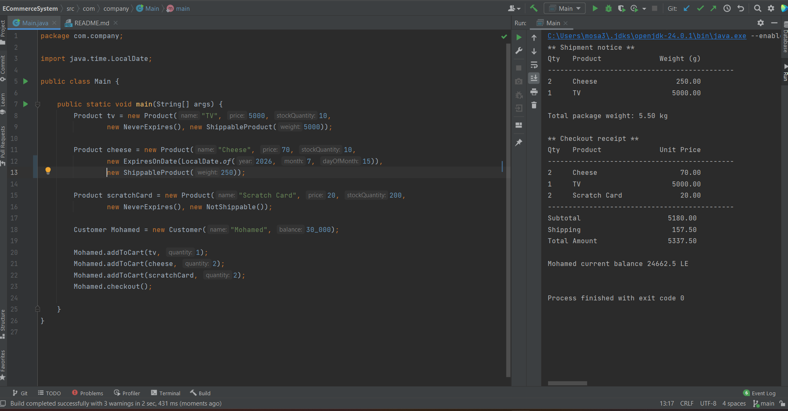

**ECommerce System UML Class Diagram**

Note: You can also preview the [UML Class Diagram](/ECommerceClassUML.pdf) as a PDF or on [LucidChart](https://lucid.app/lucidchart/27557ed7-c1e4-4491-a1ca-0465c8763e5c/edit?viewport_loc=-1728%2C-205%2C6094%2C2654%2C0_0&invitationId=inv_d546aac8-3b47-4ccd-a0de-d3f10f0a592a)

**Testing**

Test #1 - A single customer named Mohamed is using the system, and he made an order successfully

Test #2 - Two customers Mohamed and Ahmed are using the system simultaneously and both of them made orders successfully

Test #3 - A customer is trying to do **checkout while the cart is empty**, an error showed with "Cart is Empty" message

Test #4 - A customer is trying to make an order, but he **does not have enough balance**, an error showed with "Insufficient balance" message.

Test #5 - A customer is **trying to buy an on out-of-stock** product, an error showed with "TV Product is unavailable" message.;

